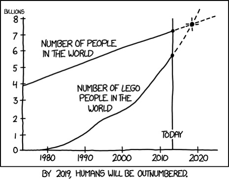

```{r setup, include=FALSE}
knitr::opts_chunk$set(echo = TRUE)
```

## Introduction

A Beginners Look At R

John Pertell  

Database Administrator for Dialysis Clinics Inc.  


Email: jpertell@gmail.com  
Twitter: @jayape  
Blog: http://www.pertell.com/sqlservings

## Who I Am


- Working for DCI since 2000
- Started working on Access reports
- Became Senior DBA in 2006

## Who I Am...Not


&nbsp;

**I am not an "R"tist**

##Agenda


* A little R background  

&nbsp;

* Working in R
    + Basic syntax
    + Functions
    + Adding and working with packages
    + Working with data - getting, shaping
    + R application (Markdown, Shiny, Notebooks)

## Agenda (If there's time)


- R and SQL 2016
  + What it is
  + Installing and configuring
  + Using R and SQL 2016

## (Not on the) Agenda


>- Math and Statistics
>- Well, maybe a little...

## A Little R Background

- Open source language used for working with data (statistics, analysis, visualization)
- One of the fastest growing, most popular languages for data scientists
- Connects to many data sources
- Runs on multiple platforms
- Available from the CRAN repository
- Constantly growing

## An R Visualization 
```{r, out.width = "800px"}

```


<http://xkcd.com/1281>


## A Little "R"efresher

<h2>Basic atomic class of objects</h2>

- Character
- Numeric
- Integer
- Logical (TRUE or FALSE)
  
<h2>Most basic object is a vector</h2>

- One dimensional 
- Can have more than one value
- Can only contain objects of the same class (character, etc)
  + (But you can create a list with different classes)
    
---

<h2>Other object types:</h2>

- Matrix - vectors with dimensions
  + Each element must be the same object class
  
- Factors - represent categorical data
  + Useful for modeling data
  + Use labels ("Yes", "No") instead of integers (1, 2)
  
- Data Frames - stores tabular data
  + Observations and variables instead of rows and columns
  + Can store different object classes in separate variables
  
## Some things to remember


- R is case sensitive
  + A variable called *A* is not the same as one called *a*
  
- You can use single (') or double (") quotes for characters
  + But you should be consistent in your code
- You can use less than minus sign (<-) or equals (=) for assigning values
  + Again, be consistent
  + <- is preferred
  
## Packages

- Packages extend R by adding functions
- Install through IDE or in script/console
- Can be installed from a .zip file if you're not connected to the internet
- Load a package for your code before using it
- Some popular packages:
  + ggplot2 - plots
  + dplyr - manipulating data
  + RODBC - connect to a ODBC data source

## An R Cheatsheet 
```{r, out.width = "1200px"}
knitr::include_graphics("images/cheatsheet1.png")
```

---

```{r, out.width = "1200px"}
knitr::include_graphics("images/cheatsheet2.png")
```

<https://www.rstudio.com/wp-content/uploads/2016/03/rmarkdown-cheatsheet-2.0.pdf>

---


&nbsp;

<h1>R Demo Time</h1>

## Basic Math

  Sign | Operation                            
  -----|----------                           
   +    | Addition                             
   -    | Subtraction
   *    | Multiplication
   /    | Division
   ^ or **   | Exponential
   %%   | Modulus
   %/%  | Integer Division


``` {r echo = TRUE, highlight = FALSE}
1 + 3
6 - 5
5 * 5
4 / 2
```
